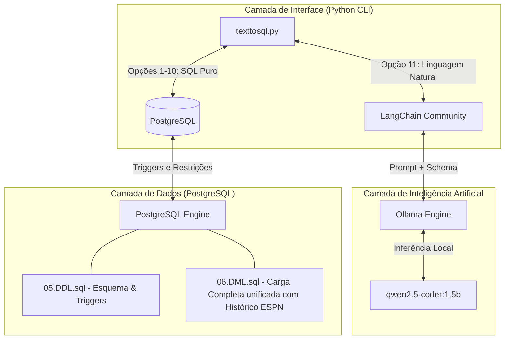

# 🏆 FIFA World Cup Database & NLP2SQL Assistant
> **SCC0640 - Bases de Dados**  
> *Instituto de Ciências Matemáticas e de Computação (ICMC - USP)*

---

Este projeto consiste em uma solução de banco de dados relacional robusto e um protótipo interativo de perguntas e respostas baseado em Inteligência Artificial local (**NLP2SQL**) para consultas sobre a história das Copas do Mundo FIFA.

O sistema integra modelagem conceitual, integridade referencial complexa por meio de **triggers em PostgreSQL**, e uma interface CLI inteligente em Python rodando o modelo de linguagem **Qwen 2.5 Coder (1.5B)** localmente pelo **Ollama**.

---

## 🎨 Visão Geral do Sistema



---

## 📂 Arquivos do Repositório

O repositório está organizado de forma limpa e estruturada, contendo os seguintes artefatos essenciais:

| Nome do Arquivo | Função no Sistema |
| :--- | :--- |
| **[`05.DDL.sql`](file:///home/nexus/BD/05.DDL.sql)** | Definição de tabelas (DDL), chaves primárias/estrangeiras, restrições e triggers (T1 a T5). |
| **[`06.DML.sql`](file:///home/nexus/BD/06.DML.sql)** | Carga completa unificada de dados (parâmetros de referência, edições, 2026 planejado, e dados reais de 2018/2022). |
| **[`wc_past_seed.sql`](file:///home/nexus/BD/wc_past_seed.sql)** | Dados históricos brutos das Copas de 2018 e 2022 extraídos para compor a carga DML (mantido como referência). |
| **[`seed_wc_past.py`](file:///home/nexus/BD/seed_wc_past.py)** | Script de integração automatizado que consome a **API Pública da ESPN** para gerar o histórico de partidas e elencos. |
| **[`texttosql.py`](file:///home/nexus/BD/texttosql.py)** | Script principal do protótipo CLI interativo com visualização tabular de consultas e NLP2SQL. |
| **[`requirements_prototipo.txt`](file:///home/nexus/BD/requirements_prototipo.txt)** | Lista de dependências Python necessárias para execução do protótipo CLI. |
| **[`08.Instrucoes.txt`](file:///home/nexus/BD/08.Instrucoes.txt)** | Manual de instalação, inicialização e operação do sistema de forma simplificada em 2 passos. |

---

## 📡 Integração com a API Pública da ESPN

Para enriquecer a base de dados com dados históricos de partidas reais, eventos (gols, cartões, substituições), arbitragem e elencos convocados, o sistema consome dados reais através dos endpoints oficiais da ESPN.

### O Script de Sincronização (`seed_wc_past.py`)
O script [`seed_wc_past.py`](file:///home/nexus/BD/seed_wc_past.py) realiza a extração e transformação dos dados reais das Copas do Mundo de **2018** (Rússia) e **2022** (Catar):
1. **Scoreboard API**: Crawla diariamente os dados de jogos das edições passadas.
   - Endpoint: `site.api.espn.com/apis/site/v2/sports/soccer/fifa.world/scoreboard`
2. **Summary API**: Enriquece cada partida com eventos ao vivo e arbitragem principal.
   - Endpoint: `site.api.espn.com/apis/site/v2/sports/soccer/fifa.world/summary?event={id}&enable=commentary`
3. **Mapeamento de Dados**:
   - Eventos de jogo (`keyEvents`) → Inseridos na tabela `EventosJogo`.
   - Listas de escalações (`rosters`) → Inseridos nas tabelas `Jogadores` e `Convocacoes`.
   - Árbitros oficiais (`officials`) → Inseridos na tabela `ArbitragemPartida` e `Arbitros`.

Este script gera o arquivo estruturado de carga de dados [`wc_past_seed.sql`](file:///home/nexus/BD/wc_past_seed.sql), contendo milhares de linhas de inserções prontas de alta fidelidade histórica.

---

## 🔒 Triggers e Regras de Negócio (PostgreSQL)

O banco de dados relacional utiliza o PostgreSQL Engine para impor a consistência das regras de negócio através de **Triggers procedimentais** (`PL/pgSQL`):

* **T1: Consistência da Seleção das Figurinhas (`fn_valida_consistencia_sticker`)**:
  Garante que a seleção (`id_selecao`) associada a uma figurinha colada coincida exatamente com a seleção atual do jogador (`id_jogador`) escalado nela, prevenindo erros de colagem de adesivos.
* **T2: Limite de Convocados (`fn_limite_jogadores`)**:
  Impõe um limite flexível e realista na tabela de `Convocacoes` por edição de Copa do Mundo.
* **T3: Atualização Automática de Classificação (`fn_atualiza_classificacao`)**:
  Recalcula automaticamente a pontuação, número de jogos, vitórias, derrotas, empates, gols marcados e sofridos na tabela `ParticipacaoGrupo` imediatamente após uma partida ser inserida ou atualizada com o status `'encerrada'`.
* **T4: Validação de Jogos Pendentes em 2026**:
  Garante que partidas cujo status não seja `'encerrada'` (como os jogos planejados para a Copa de 2026 que ainda não ocorreram) não pontuem ou interfiram erroneamente nas tabelas de estatísticas e classificação de grupos da edição correspondente.

---

## 🤖 Protótipo CLI & Tradução NLP2SQL Local

O protótipo CLI interativo [`texttosql.py`](file:///home/nexus/BD/texttosql.py) oferece dois modos principais de operação:

### 1. Consultas Pré-definidas (Opções 1 a 10)
Ações comuns parametrizadas que realizam buscas otimizadas com suporte a:
* **Buscas Insensíveis a Acentos e Caixa (Case/Accent-Insensitive)**: Utiliza a extensão `unaccent` do PostgreSQL e operadores `ILIKE` para garantir que buscar `"Brasil"`, `"brasil"`, `"Franca"` ou `"França"` retorne os mesmos registros com precisão.
* **Ordenação Ambidestra de Partidas**: Na busca por eventos de partida (Opção 8), o algoritmo pesquisa de forma simétrica em ambas as direções (`time A x time B` ou `time B x time A`).

### 2. Consulta em Linguagem Natural (Opção 11 - NLP2SQL)
Uma funcionalidade avançada que traduz perguntas diretas em linguagem comum para SQL válido.
* **Segurança e Privacidade**: A geração é realizada **100% offline** utilizando o motor **Ollama** com o modelo `qwen2.5-coder:1.5b`.
* **Prompt Estruturado**: O sistema injeta dinamicamente o esquema relacional atualizado do banco de dados (DDL) junto a diretrizes rigorosas de integridade (como regras para obtenção de campeões pelas edições) no contexto do modelo para obter queries SQL limpas e precisas.
* **Visualização Avançada em Grid ASCII**: Todas as respostas geradas são formatadas dinamicamente em uma tabela estruturada premium no terminal:

```text
+--------------------+---------+---------------+
|        nome        | posicao | numero_camisa |
+--------------------+---------+---------------+
| Alisson Becker     | GK      |             1 |
| Danilo             | MID     |             2 |
| Thiago Silva       | DEF     |             3 |
| Marquinhos         | DEF     |             4 |
| Casemiro           | MID     |             5 |
+--------------------+---------+---------------+
```

---

## ⚡ Como Instalar e Executar

### Passo 1: Preparar o Banco de Dados (PostgreSQL)
1. Crie a base de dados `album_copa`:
   ```bash
   createdb -h localhost -U postgres album_copa
   ```
2. Carregue o DDL (tabelas, restrições e triggers):
   ```bash
   psql -h localhost -U postgres -d album_copa -f 05.DDL.sql
   ```
3. Carregue a carga completa de dados unificada:
   ```bash
   psql -h localhost -U postgres -d album_copa -f 06.DML.sql
   ```

### Passo 2: Configurar o Motor de IA Local
1. Instale o [Ollama](https://ollama.com/) em seu sistema.
2. Realize o download local do modelo de codificação:
   ```bash
   ollama pull qwen2.5-coder:1.5b
   ```

### Passo 3: Executar a CLI
1. Crie e ative um ambiente virtual Python:
   ```bash
   python3 -m venv venv_prototipo
   source venv_prototipo/bin/activate
   ```
2. Instale as dependências:
   ```bash
   pip install -r requirements_prototipo.txt
   ```
3. Inicie o sistema interativo:
   ```bash
   python3 texttosql.py
   ```

---

## 👥 Autores
* Desenvolvido para a disciplina **SCC0640 - Bases de Dados** (ICMC - USP).
* Autoria de commit e pushes configurada sob o perfil acadêmico **murilo-vinicius04** (`murilo.mv4321@usp.br`).
